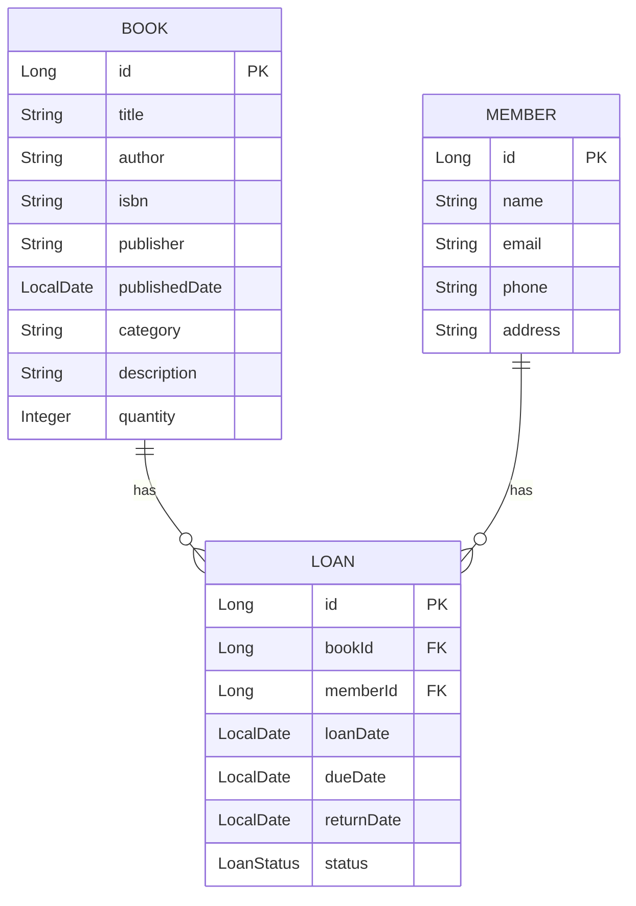

# 도서관 관리 시스템 API 명세서

## 1. 기술 스택

### Backend
- Java 17
- Spring Boot 3.x
- Spring Data JPA
- H2 Database (개발 환경)
- Gradle

### 프로젝트 구조
```
src/main/java/com/group/libraryapp/
├── config/         # 설정 클래스
├── controller/     # API 엔드포인트
├── domain/        # 도메인 모델
├── dto/           # 데이터 전송 객체
├── repository/    # 데이터 접근 계층
└── service/       # 비즈니스 로직
```

## 2. API 엔드포인트

### 도서 관리 API

#### 도서 등록
- **URL**: `/api/books`
- **Method**: POST
- **Request Body**:
```json
{
    "title": "string",
    "author": "string",
    "isbn": "string",
    "publisher": "string",
    "publishedDate": "date",
    "category": "string",
    "description": "string",
    "quantity": "number"
}
```
- **Response**: 201 Created

#### 도서 조회
- **URL**: `/api/books/{id}`
- **Method**: GET
- **Response**:
```json
{
    "id": "number",
    "title": "string",
    "author": "string",
    "isbn": "string",
    "publisher": "string",
    "publishedDate": "date",
    "category": "string",
    "description": "string",
    "quantity": "number"
}
```

#### 도서 목록 조회
- **URL**: `/api/books`
- **Method**: GET
- **Query Parameters**:
  - page: 페이지 번호 (기본값: 0)
  - size: 페이지 크기 (기본값: 10)
  - sort: 정렬 기준 (기본값: id,desc)
- **Response**: Page<BookDto>

### 회원 관리 API

#### 회원 등록
- **URL**: `/api/members`
- **Method**: POST
- **Request Body**:
```json
{
    "name": "string",
    "email": "string",
    "phone": "string",
    "address": "string"
}
```
- **Response**: 201 Created

#### 회원 조회
- **URL**: `/api/members/{id}`
- **Method**: GET
- **Response**:
```json
{
    "id": "number",
    "name": "string",
    "email": "string",
    "phone": "string",
    "address": "string"
}
```

### 대출 관리 API

#### 도서 대출
- **URL**: `/api/loans`
- **Method**: POST
- **Request Body**:
```json
{
    "bookId": "number",
    "memberId": "number",
    "loanDate": "date",
    "dueDate": "date"
}
```
- **Response**: 201 Created

#### 도서 반납
- **URL**: `/api/loans/{id}/return`
- **Method**: PUT
- **Response**: 200 OK

## 3. DTO (Data Transfer Objects)

### BookDto
```java
public class BookDto {
    private Long id;
    private String title;
    private String author;
    private String isbn;
    private String publisher;
    private LocalDate publishedDate;
    private String category;
    private String description;
    private Integer quantity;
}
```

### MemberDto
```java
public class MemberDto {
    private Long id;
    private String name;
    private String email;
    private String phone;
    private String address;
}
```

### LoanDto
```java
public class LoanDto {
    private Long id;
    private Long bookId;
    private Long memberId;
    private LocalDate loanDate;
    private LocalDate dueDate;
    private LocalDate returnDate;
    private LoanStatus status;
}
```

## 4. ERD (Entity Relationship Diagram)



## 5. 주요 기능

1. 도서 관리
   - 도서 등록, 수정, 삭제
   - 도서 검색 (제목, 저자, ISBN)
   - 도서 재고 관리

2. 회원 관리
   - 회원 등록, 수정, 삭제
   - 회원 검색
   - 회원 대출 이력 조회

3. 대출 관리
   - 도서 대출/반납 처리
   - 연체 관리
   - 대출 이력 조회

4. 통계 및 보고서
   - 도서별 대출 통계
   - 회원별 대출 통계
   - 연체 도서 현황 